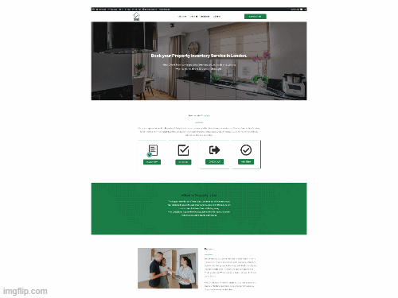

<h1 align="center">Welcome to MEHEDI HASAN SHUBHO 
</h1>

<!--  -->

 

<i>A curated list of awesome Github Profile READMEs</i>

 </img>

<i>Loved the project? Please consider [donating](https://paypal.me/abhisheknaiidu) to help it improve!</i>

### Contents:
  - [Categories](#categories)
      - [GitHub Actions 🤖](#github-actions-)
      - [Game Mode 🚀](#game-mode-)
      - [Code Mode 👨🏽‍💻](#code-mode-)
      - [Dynamic Realtime 💫](#dynamic-realtime-)
      - [A Little Bit of Everything 😃](#a-little-bit-of-everything-)
      - [Descriptive 🗒](#descriptive-)
      - [Simple but Innovative Ones 🤗](#simple-but-innovative-ones-)
      - [Typing.. Mode 🎰](#typing-mode-)
      - [Anime 👾](#anime-)
      - [Minimalistic ✨](#minimalistic-)
      - [GIFS 👻](#gifs-)
      - [Just Images 🎭](#just-images-)
      - [Badges 🎫](#badges-)
      - [Fancy Fonts 🖋](#fancy-fonts-)
      - [Icons 🎯](#icons-)
      - [Retro 😎](#retro-)
  - [Tools](#tools)
  - [Articles](#articles)
  - [Video Tutorials](#tutorials)
  - [Contribute](#contribute)
  - [License](#license)

## Categories

#### GitHub Actions 🤖

#### Dynamic Realtime 💫

#### A Little Bit of Everything 😃

#### Descriptive 🗒

#### Simple but Innovative Ones 🤗

#### Typing.. Mode 🎰
- [Mathieu Ledru](https://github.com/matyo91/matyo91)
- [CyrisXD](https://github.com/CyrisXD/CyrisXD)
- [Mpho Mphego](https://github.com/mmphego/mmphego)
- [Abhinav Sharma](https://github.com/ABSphreak/ABSphreak)
- [Mason Slover](https://github.com/MasonSlover/MasonSlover)
- [SuperSupeng](https://github.com/SuperSupeng/SuperSupeng)

